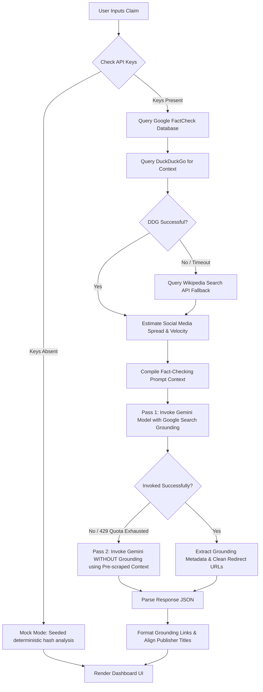

# Veritas: Misinformation Spread Analyser 🔍🛡️

Veritas is a state-of-the-art, real-time misinformation analyzer and spread estimator. Built with a modern FastAPI backend and a glassmorphic dashboard frontend, it leverages Gemini models to dissect online rumors, fact-check claims against live databases, and calculate their spread across major social platforms.

---

## ⚠️ The Problem

In the modern digital landscape, misinformation spreads faster than verified facts. Traditional approaches to addressing this face several key bottlenecks:
* **The "Black Box" Problem**: Users are often presented with a simple "True" or "False" label without grounding sources, references, or transparent reasoning.
* **API Rate Limits and Grounding Exhaustion**: Heavy reliance on live search grounding tools (like Google Search Grounding) often leads to API quota exhaustion (`RESOURCE_EXHAUSTED` / 429 errors), rendering automated systems temporarily offline.
* **Rate-Limit Blockades**: Relying on single search providers for context gathering can cause complete request failures if a provider rate-limits requests or blocks them.
* **Attribution vs. Substance Ambiguity**: Fact-checkers struggle to separate *who* said a claim from *whether* the substance of the claim is actually true, leading to confusing verdicts.

---

## ✨ The Solution: Veritas

Veritas solves these issues by providing a highly-resilient, transparent, and explainable fact-checking pipeline:
* **Explainable Trust Score**: Combines factual validation, source credibility, and platform velocity into an intuitive radial gauge.
* **Dual-Pass Self-Healing Engine**: A fallback loop that guarantees uptime by switching from grounded search prompts to pre-scraped context prompts if API limits are hit.
* **Multi-Search Redundancy**: Falls back from DuckDuckGo search context to Wikipedia search context automatically to bypass scraping blocks.
* **Attributed Statement Checking**: Specifically handles "X claimed Y" queries, checking attribution credibility and substance validity separately before establishing a verdict.
* **Rich Dashboard UI**: A premium, responsive glassmorphic frontend utilizing custom micro-animations, linear gradient charting, and persistent local storage caching.

---

## ⚙️ How It Works (Internal Mechanics)

Veritas runs a multi-stage verification pipeline for every claim analyzed:



### Detailed Execution Flow

1. **API Status Determination**:
   * The backend checks if `GEMINI_API_KEY` is present. If it is, the app initializes in **Live Mode**. Otherwise, it gracefully falls back to **Mock Mode**, providing deterministic, pseudo-random mock analyses based on the hash of the query so developers can test the dashboard instantly without keys.

2. **Database Cross-Referencing**:
   * It queries the Google Fact Check Tools API to find claims reviewed by recognized fact-checking publishers (e.g., Snopes, FactCheck.org, Reuters) and retrieves their official ratings.

3. **Multi-Source Context Scraping**:
   * It searches DuckDuckGo for recent news snippets related to the claim.
   * If DuckDuckGo blocks the request or times out, the backend automatically triggers a fallback to the **Wikipedia Search API**, querying page summaries to feed high-quality background information to the model.

4. **Pass 1: Live Grounded AI Analysis**:
   * Prioritizes active Gemini models (`gemini-2.0-flash`, `gemini-2.5-flash`, etc.) using the `google-genai` SDK.
   * Enables Google Search Grounding inside the model configuration to fetch the latest real-time search results directly.

5. **Pass 2: Non-Grounded Self-Healing Fallback**:
   * If Pass 1 returns a `RESOURCE_EXHAUSTED` (429) rate limit or quota exception, the system catches the error, disables the Google Search Grounding tool, and retries.
   * In Pass 2, it injects the scraped DuckDuckGo/Wikipedia snippets and Google FactCheck reviews directly into the prompt context, guaranteeing a successful factual evaluation.

6. **Grounding Metadata Cleaning**:
   * Extracts matching sources and replaces generic Google Search redirect URLs (like `vertexaisearch.cloud.google.com`) with direct source links (e.g., `wikipedia.org` or `cbsnews.com`) and direct publisher titles.

7. **Social Spread Analysis**:
   * Scores social sharing indicators (matching domains/keywords for X/Twitter, Reddit, Facebook, YouTube, TikTok, and Instagram) in the search snippets.
   * Normalizes these scores to estimate the platform-specific spread and computes the velocity (`Critical`, `High`, `Medium`, or `Low`).

---

## 🛠️ Technology Stack

* **Backend**:
  * [Python 3.8+](https://www.python.org/)
  * [FastAPI](https://fastapi.tiangolo.com/) (Async API Router)
  * [Uvicorn](https://www.uvicorn.org/) (ASGI Web Server)
  * [Google GenAI SDK](https://github.com/google/generative-ai-python) (API interaction)
* **Frontend**:
  * HTML5 & Vanilla CSS3 (Glassmorphism layout, responsive CSS Grids, custom pulse animations)
  * Vanilla JavaScript (ES6, dynamic Trust Score circular gauge calculations, state machine)
  * [Chart.js](https://www.chartjs.org/) (Linear gradients and platform analytics visualization)
  * [FontAwesome](https://fontawesome.com/) (UI iconography)

---

## 🚀 Getting Started

### 1. Prerequisites
Ensure you have Python 3.8+ installed on your computer.

### 2. Configure Environment Variables
Create a file named `.env` in the root directory and configure your keys:
```env
GEMINI_API_KEY=your_gemini_api_key_here
GOOGLE_FACT_CHECK_API_KEY=your_google_factcheck_key_here
PORT=8000
HOST=127.0.0.1
```
*Note: If no keys are provided, Veritas will automatically run in **Mock Mode**, allowing you to explore the dashboard using realistic simulation data.*

### 3. Launching the Application
You can run the application using either of the following methods:

#### Method A: Automated Launcher (Windows)
Double-click `run.bat` in the project root. This script will:
* Check for a Python installation.
* Create a virtual environment `.venv` if it doesn't exist.
* Upgrade `pip` and install all dependencies listed in `requirements.txt`.
* Run the FastAPI server.

#### Method B: Manual Terminal Execution (All Platforms)
1. Open your terminal in the project directory.
2. Create and activate a virtual environment:
   ```bash
   python -m venv .venv
   source .venv/bin/activate  # On Linux/macOS
   .venv\Scripts\activate     # On Windows
   ```
3. Install dependencies:
   ```bash
   pip install -r requirements.txt
   ```
4. Start the server:
   ```bash
   python main.py
   ```

### 4. Viewing the Dashboard
Once the server starts, open your web browser and navigate to:
```
http://127.0.0.1:8000
```
Enter any claim (e.g., *"Did Apollo moon landing actually happen?"*) in the fact-checking input box and click **Analyze Claim** to view the live verification report!

---

## 📁 Project Directory Structure
```
Misinformation-Spread-Analyzer/
├── static/
│   ├── index.html        # HTML layout, responsive SPA state wrappers
│   ├── style.css         # Glassmorphism design tokens, centered loader, badge colors
│   └── app.js            # Frontend logic, Trust Score ring meter, Chart.js gradients
├── .env                  # Configuration variables (API keys, ports)
├── .gitignore            # Git exclusions (.env, .venv, pycache)
├── main.py               # FastAPI backend, search scrapers, dual-pass LLM pipeline
├── README.md             # Project documentation (this file)
├── requirements.txt      # Python dependencies
└── run.bat               # Automated environment setup and launcher (Windows)
```